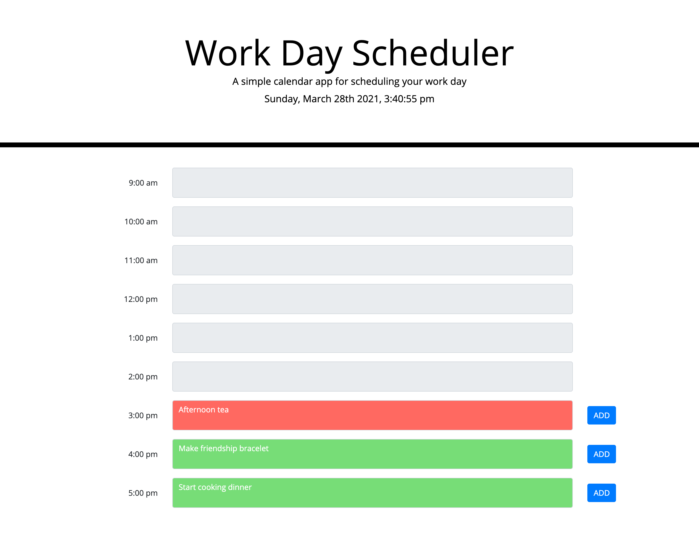

# Work Day Schedule

A simple calendar application that allows user to save events for each hour of the day. This app runs on the browser and feature dynamically updated HTML and CSS powered by jQuery.

- A user must click on "Add" button for their event to be saved.
- For events that have passed, it can no longer be edited.

## Application URL

## Screenshot of application

